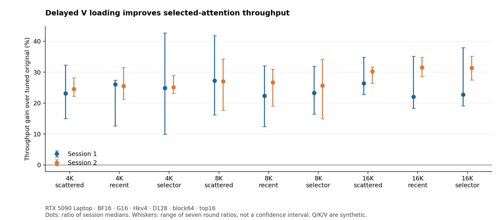
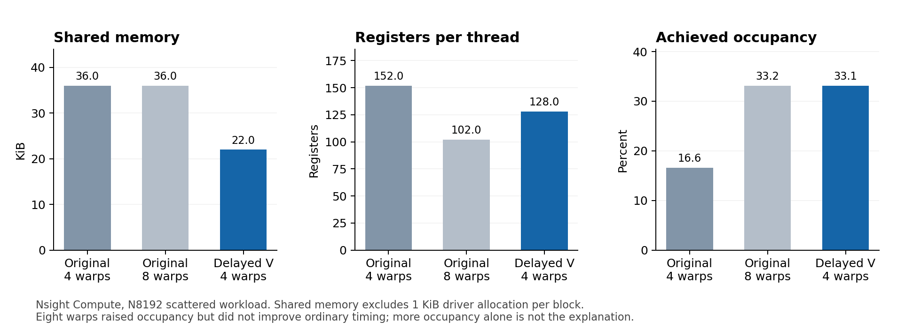

# Optimizing NSA selected attention on an RTX 5090 Laptop

## Abstract

This project optimizes the forward selected-attention branch of Native Sparse
Attention (NSA) in a pinned FLA Triton implementation. The change delays loading
the value tile until attention probabilities have been computed, shortening its
live range while preserving the selected blocks and attention arithmetic. On an
RTX 5090 Laptop GPU with PyTorch 2.8.0 and Triton 3.4.0, the profiled kernel's
shared memory falls from 36 to 22 KiB per thread block and registers from 152 to
128 per thread. Synchronized, batched forward measurements against the unchanged
original with a 12-configuration tuning search show 22.1–31.5% higher
selected-branch throughput across nine synthetic D128/block64 workloads in two
fresh-process sessions. Validation includes 166 passing numerical comparisons
against an independent CPU FP64 reference and all four Compute Sanitizer modes
passing ten cases each. The fixed four-warp candidate regresses on smaller
D64/block16 shapes. The result establishes a workload-specific kernel improvement;
full-model performance has not been measured.



## 1. Attention mechanism

Attention compares a query Q with keys K, turns the resulting scores into
weights using softmax, and uses those weights to combine values V. Dense
attention considers every allowed key. [Native Sparse Attention](https://arxiv.org/abs/2502.11089)
combines three branches: attention over compressed blocks, attention over selected
blocks at token resolution, and attention over a local sliding window.

This project studies the selected branch. For each query, it visits chosen
blocks of K and V and applies the causal mask, so future tokens cannot contribute.
The optimization preserves the selected indices, mask, score scaling, softmax,
and weighted sum. Compression, block selection, and the sliding-window branch
are outside the optimized operation.

The main workloads use grouped-query attention: 64 query heads share four K/V
heads, giving 16 query heads per K/V head (`G=16`). The kernel processes these
groups together to reuse K/V data. All activations in this study are synthetic;
no trained model or downloaded weights are required.

## 2. Optimization method

The original FLA loop loads both K and V before computing attention scores. K is
needed immediately, but V is only consumed after the probability calculation.
The candidate moves that V load closer to its use:

```python
# Original: simplified order within each selected-block iteration
k = load(key_tile)
v = load(value_tile)
scores = causal_mask(dot(q, k))
p, state = online_softmax_update(scores, state)
output = rescale(output, state) + dot(p, v)

# Candidate: same computation, later value load
k = load(key_tile)
scores = causal_mask(dot(q, k))
p, state = online_softmax_update(scores, state)
v = load(value_tile)  # moved here
output = rescale(output, state) + dot(p, v)
```

This is explanatory pseudocode; the exact two-line move is in
[the kernel patch](patches/fla-late-v.patch), and the runnable derivative is in
[candidates/late_v.py](candidates/late_v.py).

Keeping V live for less time reduces overlapping storage needs in the code
generated by this compiler. GPU multiprocessors have finite register and shared
memory budgets. Lower use per thread block can allow more blocks to run at once.
Nsight Compute and compiled-kernel metadata show the following at the profiled
D128/block64 target with four warps:

| Resource | Original | Delayed V load |
| --- | ---: | ---: |
| Shared memory per block | 36 KiB | 22 KiB |
| Registers per thread | 152 | 128 |
| Resource-limited resident blocks per multiprocessor | 2 | 4 |
| Achieved occupancy | 16.59% | 33.14% |
| Reported register spills | 0 | 0 |

Shared-memory values exclude the additional 1 KiB driver allocation per block.
Occupancy measures how many warps are active relative to the hardware maximum;
it is a diagnostic, not the optimization goal. An unchanged eight-warp control
also raised occupancy but failed to improve ordinary execution time. See the
[five-arm experiment and counters](EXPERIMENT_RESULTS.md).



## 3. Measurement and validation

### Environment and workloads

| Item | Configuration |
| --- | --- |
| GPU | RTX 5090 Laptop GPU, approximately 24 GB, compute capability 12.0 |
| Host | Ubuntu 24.04 under WSL2; NVIDIA driver 596.36 |
| Software | Python 3.12.3, PyTorch 2.8.0+cu128, Triton 3.4.0, CUDA toolkit 12.8.93 |
| Input type | BF16, seeded synthetic Q/K/V; main sessions use seed 29 |
| Sequence lengths | 4,096; 8,192; 16,384 tokens |
| Heads and dimensions | 64 query heads, 4 K/V heads; key and value dimensions 128 |
| Sparse layout | 64-token blocks; up to 16 selected blocks per query |
| Selection patterns | Scattered, recent, and upstream FLA compression/top-k selections |

The three lengths and three patterns form nine workloads. The FLA selector runs
the actual selection algorithm on synthetic inputs; its indices are not evidence
of a trained model's attention distribution.

### Baselines and controls

Three implementations were reproduced during the
[baseline assessment](BASELINE_RESULTS.md):

| Implementation | Pinned source | Role |
| --- | --- | --- |
| Native Sparse Attention Triton | [9bea856](https://github.com/XunhaoLai/native-sparse-attention-triton/tree/9bea856c911ebf263be88d797fb28458f82f1d94) | Independent baseline |
| FLA standalone NSA | [bd67af5](https://github.com/fla-org/native-sparse-attention/tree/bd67af59b90afa34b25f61d2922e612d10dba3bd) | Original kernel and source of the candidate |
| Flash Sparse Attention | [1325e8d](https://github.com/Relaxed-System-Lab/Flash-Sparse-Attention/tree/1325e8dbf18e430753e2d5e41cab9c262250ee7f) | Baseline with a recorded pointer compatibility patch |

Flash Sparse Attention uses its NSA fallback at `G=16`; its specialized path
supports smaller groups. The [compatibility patch](patches/fsa-pointer.patch)
is separate from the optimization. Source revisions and allowed changes are
checked by the harness.

The final study compares three providers using the same allocation/launch wrapper:

| Provider | Kernel | Launch configuration |
| --- | --- | --- |
| `fla` | Unchanged original | Original autotuner |
| `fla_tuned` | Unchanged original | Searches 1/2/4/8 warps × 1/2/3 stages per workload |
| `late_v_w4` | Delayed V load | Four warps, three stages |

The headline improvement is relative to `fla_tuned`. Its broader search helps
test whether ordinary launch tuning can account for the gain. The newer integrated
FLA package was inspected separately but was not benchmarked; this project does
not establish the fastest available implementation.

### Timing protocol

Each of two fresh-process sessions contains seven rounds and three batches per
provider per round, giving 21 samples per provider/workload/session. Batches target
100 ms with 10–256 invocations; the harness warms up first. Provider order rotates,
and the second session reverses the initial order.

Inputs and indices are already on the GPU in native layout. Synchronized batch
wall time includes eager dispatch, native output allocation, and selected-attention
forward execution. It excludes input generation, transfers, layout conversion,
compression/selection, compilation, and autotuning. Identical inputs are reused
without explicit cache flushing: this is a warm-cache measurement.

The reported latency is the median per-invocation batch time. For a fixed workload:

```text
throughput gain (%) = (original median latency / candidate median latency - 1) × 100
```

Throughput here counts query tokens processed by the selected branch, not generated
language-model tokens. Raw CUDA-event intervals, round samples, source/input hashes,
tuning choices, and GPU telemetry are retained. Laptop clocks vary, so sessions are
reported separately. Nsight's cache-flushed, base-clock profile durations are used
for diagnosis, not for the headline timing result.

### Correctness and sanitizer checks

Timing requires successful correctness gates with matching input and source hashes.
An independent CPU FP64 reference computes dense attention with the same selected
blocks and causal mask, starting from the same quantized inputs.

- 166 numerical comparisons passed across 52 distinct input configurations.
  These include multiple providers, seeds, dimensions, block sizes, head groups,
  FP16/BF16, and packed sequences.
- Checked elements satisfy `abs(error) <= 0.01 + 0.01 * abs(reference)`;
  relative L2 error must also be at most `0.01`. The maximum observed relative L2
  error across these reports is `0.00241723`.
- Small cases check every query row. Large cases check up to 24 deterministic rows
  plus finiteness of all outputs. Two analytic tests check the CPU reference itself.
- Compute Sanitizer memcheck, racecheck, synccheck, and initcheck each pass ten
  cases, including the 8K target, with exit code zero and zero reported errors.
  Their 40 numerical rechecks are separate from the 166 comparisons above.

Valid-read and intentionally invalid-read controls verify that instrumentation
works. Memcheck/racecheck/synccheck target the selected-attention kernels; initcheck
runs unfiltered to track writes through PyTorch helpers and the selector. The first
filtered initcheck diagnostic is retained alongside the successful unfiltered run.
See [sanitizer evidence and exact scope](SANITIZER_RESULTS.md). This validation
does not cover backward gradients, separate log-sum-exp outputs, or every element
of the large output tensors.

## 4. Results and limitations

Times are milliseconds; each pair is tuned original / candidate. Gains are
calculated from unrounded medians.

| Tokens | Selection | Session 1 time | Gain | Session 2 time | Gain |
| ---: | --- | ---: | ---: | ---: | ---: |
| 4,096 | Scattered | 3.164 / 2.570 | 23.14% | 3.181 / 2.553 | 24.58% |
| 4,096 | Recent | 3.180 / 2.523 | 26.04% | 3.177 / 2.531 | 25.54% |
| 4,096 | FLA selector | 3.185 / 2.551 | 24.85% | 3.183 / 2.544 | 25.12% |
| 8,192 | Scattered | 6.809 / 5.350 | 27.27% | 6.881 / 5.419 | 26.99% |
| 8,192 | Recent | 6.672 / 5.453 | 22.36% | 6.836 / 5.396 | 26.69% |
| 8,192 | FLA selector | 6.769 / 5.488 | 23.34% | 6.871 / 5.469 | 25.63% |
| 16,384 | Scattered | 14.081 / 11.139 | 26.41% | 14.119 / 10.839 | 30.26% |
| 16,384 | Recent | 13.917 / 11.401 | 22.07% | 14.495 / 11.020 | 31.54% |
| 16,384 | FLA selector | 14.252 / 11.608 | 22.78% | 14.391 / 10.955 | 31.37% |

All seven comparisons of round medians favor the candidate for every workload and
session against both original controls. The opening chart's whiskers show the
range of the seven round ratios; they are not confidence intervals. The reported
22.1–31.5% range describes these observations, not a guarantee for other workloads.
Inspect [session 1](results/study_session1.json),
[session 2](results/study_session2.json), and the
[derived summary](results/study_summary.json).

### Where the candidate loses

The compatible research checkpoint `zen-E/NSA-1B` uses smaller D64/block16 tiles.
Synthetic tests matching that shape, with FLA-generated selections, show a regression:

| Shape | Tuned original | Fixed four-warp candidate | Throughput change |
| --- | ---: | ---: | ---: |
| N=2048, Hkv2/G16/D64/block16 | 0.0758 ms | 0.1315 ms | -42.34% |
| N=8192, Hkv2/G16/D64/block16 | 0.3330 ms | 0.5914 ms | -43.69% |

The original chooses one warp on these shapes, while the candidate fixes four.
This rejects transferring the chosen configuration unchanged; it does not establish
that all delayed-load configurations are slower. No checkpoint weights were
downloaded and no full model was run. See the
[model-shape measurements](results/model_shape_timings.json) and
[checkpoint assessment](PRIOR_WORK_AND_MODEL.md).

The contribution is a reproducible implementation study on this GPU and compiler.
Delayed V loading is an established technique, also visible in
[Triton's fused-attention tutorial](https://triton-lang.org/main/getting-started/tutorials/06-fused-attention.html).
The evidence supports the measured forward selected-branch gain; it does not
establish a new attention algorithm, training or decoding speedup, model quality,
or results on a desktop RTX 5090 or other GPUs.

## Reproduce

Use Ubuntu 24.04 / WSL2 with a working NVIDIA CUDA driver, `git`, a C compiler,
and `uv` on PATH. Run inside a Linux/WSL shell:

```bash
git clone https://github.com/lucastsui/nsa-attention-optimization.git
cd nsa-attention-optimization
bash bootstrap_baselines.sh
bash reproduce.sh my_run
```

Bootstrap pins dependencies and source revisions; runtime files live in ignored
`.runtime/`, or the directory named by `NSA_RUNTIME_DIR`. Reproduction runs the
analytic reference tests, validates all 33 expanded cases against three providers,
then benchmarks the nine target workloads. Choose a fresh run ID each time.

With Compute Sanitizer installed and the Windows GPU debugger interface enabled:

```bash
python3 run_sanitizers.py --tag my_check
```

To audit the checked-in artifact hashes, syntax, local documentation links, and
recorded sanitizer evidence without a GPU or third-party Python packages:

```bash
python3 audit_artifacts.py
```

GitHub Actions runs that recorded-evidence audit. It does not rerun GPU validation
or benchmark performance. Detailed setup, timing boundaries, profiler commands,
and figure generation are in [REPRODUCIBILITY.md](REPRODUCIBILITY.md).

## Repository guide

| Location | Contents |
| --- | --- |
| [candidates/late_v.py](candidates/late_v.py), [patches/](patches/) | Candidate kernel and exact upstream changes |
| [study.py](study.py), [experiments.py](experiments.py) | Final study and initial five-arm experiment |
| [check_nsa.py](check_nsa.py), [test_reference.py](test_reference.py) | Independent reference, workload generation, analytic checks |
| [results/](results/), [figures/](figures/) | Raw measurements, validation, profiler reports, and PNG/SVG figures |
| [FINAL_REPORT.md](FINAL_REPORT.md) | Consolidated findings and validation accounting |
| [BASELINE_RESULTS.md](BASELINE_RESULTS.md), [PROFILE_RESULTS.md](PROFILE_RESULTS.md), [EXPERIMENT_RESULTS.md](EXPERIMENT_RESULTS.md) | Baseline reproduction, profiling, and early experiments |
| [SANITIZER_RESULTS.md](SANITIZER_RESULTS.md), [PRIOR_WORK_AND_MODEL.md](PRIOR_WORK_AND_MODEL.md) | Sanitizer details, attribution, and model assessment |
| [ARTIFACT_MANIFEST.json](ARTIFACT_MANIFEST.json) | SHA-256 hashes of packaged files, excluding the manifest itself |

## Attribution and license

The attention mechanism comes from the [NSA paper](https://arxiv.org/abs/2502.11089).
The derivative kernel retains FLA's copyright and
[MIT license](candidates/LICENSE.fla). Project code is provided under the
[MIT license](LICENSE). Upstream repositories, pinned revisions, and the established
optimization technique are credited above and in the prior-work report.
